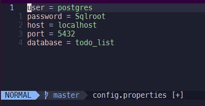
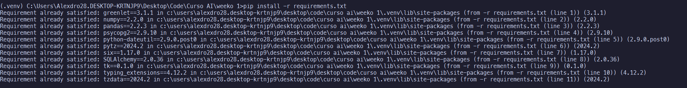
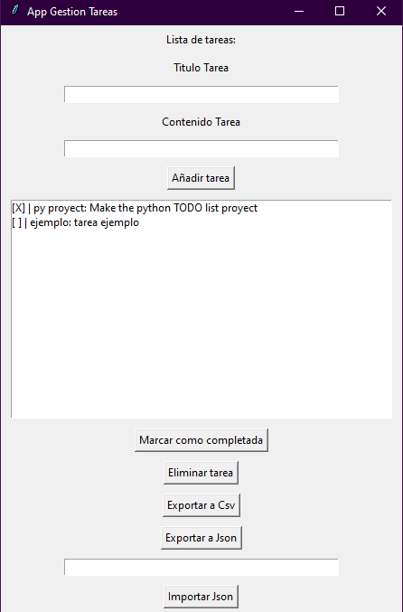

# Task Manager in Python

Requerimientos

- PostgreSQL
- Python

para iniciar el programa, configure sus credenciales de postgreSQL en el archivo "config.properties"



si lo prefieres, genera un entorno virtual para ejecutar el proyecto:

```bash
python -m venv .venv

.venv\Scripts\activate
```

luego, puede instalar las dependencias ejecutando el siguiente comando en CMD de la carpeta raiz:

```bash
pip install -r requirements.txt
```



y por ultimo ejecutar el archivo main.py

```bash
py main.py
```

le aparecera esta ventana cuando ejecute el programa:



ahi podra añadir, eliminar, marcar como completadas e importar y exportar tareas en diferentes formatos
